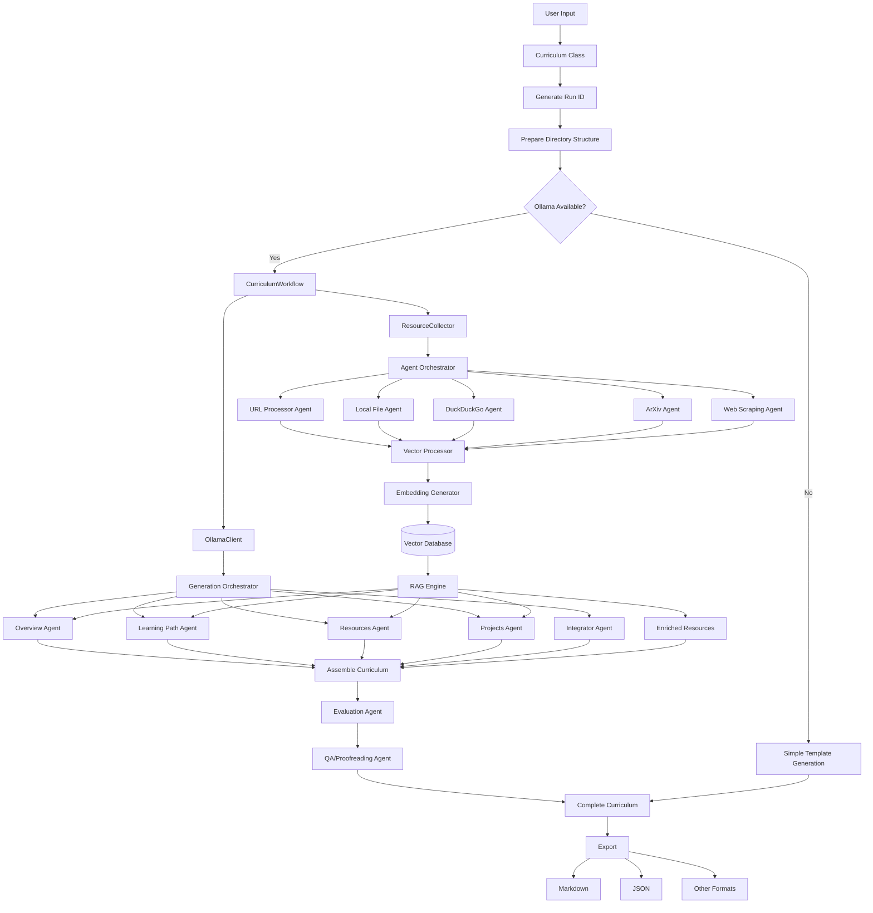

# Osyllabi Curriculum Generation Workflow

This document outlines how Osyllabi generates new curriculums using AI integration with Ollama, resource collection, and content assembly.

## Workflow Diagram



## Explanation

The Osyllabi curriculum generation workflow implements a modular approach to creating educational content with AI assistance. Here's how it works:

1. **User Input**: The process begins with user inputs including the main topic, skill level, optional resource links, and source files or directories.

2. **Curriculum Class & Run Management**:
   - The main `Curriculum` class receives inputs and generates a unique run ID based on epoch time
   - Creates a structured directory hierarchy for the current generation run
   - Determines whether to use advanced AI generation or a simple template approach

3. **AI Availability Check**: The system checks if the Ollama server is accessible. If it is, the workflow continues with AI-powered generation; otherwise, it falls back to simple template-based generation.

4. **Resource Collection**: The `ResourceCollector` uses multiple specialized agents to gather content:
   - **URL Processor Agent**: Extracts and processes content from user-provided URLs
   - **Local File Agent**: Analyzes source files and directories for relevant educational material
   - **DuckDuckGo Agent**: Performs web searches via DuckDuckGo API to find relevant resources
   - **ArXiv Agent**: Searches academic papers on arXiv related to the curriculum topic
   - **Web Scraping Agent**: Deep crawls websites to collect additional context and resources

5. **RAG Processing**: Each collected resource is processed through the RAG pipeline:
   - **Vector Processor**: Chunks and preprocesses text content for embedding
   - **Embedding Generator**: Converts text chunks into vector embeddings
   - **Vector Database**: Stores embeddings with their source metadata in a SQLite database
   - **RAG Engine**: Retrieves relevant content based on semantic similarity for each generation task

6. **AI Content Generation**: When Ollama is available, multiple specialized agents generate content with RAG enhancement:
   - **Overview Agent**: Creates an introduction explaining the topic, its importance, audience, and outcomes
   - **Learning Path Agent**: Designs a structured progression of modules with clear objectives and time estimates
   - **Resources Agent**: Curates learning materials incorporating user-provided links and collected resources
   - **Projects Agent**: Develops practical exercises that reinforce concepts with increasing complexity
   - **Integrator Agent**: Ensures coherence across all sections and consistent terminology

7. **Quality Assurance**: Generated content passes through:
   - **Evaluation Agent**: Assesses content quality, completeness, and adherence to requirements
   - **QA/Proofreading Agent**: Checks for grammar, spelling, consistency, and readability issues

8. **Content Assembly**: All generated sections are assembled into a cohesive curriculum document with proper formatting and structure.

9. **Export**: The final curriculum is exported in the user's chosen format (Markdown, JSON, etc.), with metadata included.

## System Architecture

### Run ID and Directory Structure

Each curriculum generation creates a unique run ID based on the Unix epoch timestamp, which serves as both an identifier and the base directory name for all artifacts related to that generation:

```bash
outputp/
└── 1698765432/               # Run ID (epoch timestamp)
    ├── config.json           # Configuration used for this run
    ├── curriculum.md         # Final curriculum output
    ├── curriculum.json       # JSON representation of the curriculum
    ├── resources/            # Collected resources
    │   ├── urls/             # Content from URLs
    │   ├── local/            # Content from local files
    │   ├── duckduckgo/       # Search results
    │   ├── arxiv/            # Academic papers
    │   └── scraped/          # Web-scraped content
    ├── components/           # Individual curriculum components
    │   ├── overview.md
    │   ├── learning_path.md
    │   ├── resources.md
    │   └── projects.md
    └── logs/                 # Generation logs and metadata
        ├── process.log       # Process log
        ├── agents.log        # Agent activity log
        └── metrics.json      # Performance metrics
```

### Agent Architecture

The system uses a modular agent architecture based on a common `Agent` base class:

```python
class Agent:
    """Base class for all specialized agents in the system."""
    
    def __init__(self, name, config=None):
        self.name = name
        self.config = config or {}
        self.results = {}
        
    async def execute(self, context):
        """Execute agent's main functionality."""
        raise NotImplementedError("Subclasses must implement execute()")
        
    def get_results(self):
        """Return agent's results."""
        return self.results
```

Agents follow these principles:

1. **Single Responsibility**: Each agent performs a specific task in the pipeline
2. **Context Sharing**: Agents share context through a common context object
3. **Asynchronous Processing**: Agents can work concurrently where appropriate
4. **Self-monitoring**: Agents track their own performance and resource usage
5. **Adaptive**: Agents can adjust their behavior based on available resources and requirements

### Resource Collection Services

#### DuckDuckGo Integration

The DuckDuckGo Agent uses the DuckDuckGo Instant Answer API to perform web searches related to the curriculum topic:

```python
class DuckDuckGoAgent(Agent):
    """Agent for collecting resources via DuckDuckGo search."""
    
    async def execute(self, context):
        # Generate search queries based on topic and skill level
        queries = self._generate_queries(context)
        
        # Perform searches
        results = []
        for query in queries:
            search_results = await self._search_duckduckgo(query)
            results.extend(search_results)
            
        # Process and store results
        processed_results = self._process_results(results)
        self.results = processed_results
        return processed_results
```

#### ArXiv Integration

The ArXiv Agent leverages the `arxiv` PyPI package to search for and retrieve academic papers relevant to the curriculum:

```python
class ArXivAgent(Agent):
    """Agent for collecting academic papers from arXiv."""
    
    async def execute(self, context):
        # Generate search queries based on topic
        query = self._format_arxiv_query(context.topic, context.skill_level)
        
        # Search arXiv
        papers = await self._search_arxiv(query, max_results=10)
        
        # Download and process papers
        processed_papers = await self._process_papers(papers)
        
        self.results = processed_papers
        return processed_papers
```

#### Web Scraping

The Web Scraping Agent performs deeper exploration of relevant websites to extract additional resources:

```python
class WebScrapingAgent(Agent):
    """Agent for deep crawling websites to extract educational content."""
    
    async def execute(self, context):
        # Get seed URLs from other agents' results
        seed_urls = self._extract_seed_urls(context)
        
        # Configure crawler depth and scope
        crawler = self._setup_crawler(max_depth=2)
        
        # Execute crawling
        crawled_content = await crawler.crawl(seed_urls)
        
        # Extract and organize relevant information
        processed_content = self._extract_educational_content(crawled_content)
        
        self.results = processed_content
        return processed_content
```

## Development Notes

### Resource Collection Priorities

When collecting resources, agents should prioritize:

1. **Accuracy**: Information must be factually correct
2. **Recency**: Prefer more recent resources, especially for fast-evolving fields
3. **Diversity**: Include different resource types (tutorials, videos, books, papers, etc.)
4. **Depth Matching**: Resources should match the specified skill level
5. **Licensing**: Prioritize open access and freely available resources

### Agent Communication

Agents communicate through a shared context object that grows during the generation process:

```python
class CurriculumContext:
    """Shared context for curriculum generation."""
    
    def __init__(self, topic, skill_level):
        self.topic = topic
        self.skill_level = skill_level
        self.resources = {}
        self.components = {}
        self.metadata = {}
        self.run_id = int(time.time())
        
    def add_resource(self, source, resource_data):
        """Add a resource to the context."""
        if source not in self.resources:
            self.resources[source] = []
        self.resources[source].append(resource_data)
        
    def add_component(self, name, content):
        """Add a curriculum component to the context."""
        self.components[name] = content
        
    def get_resources_by_relevance(self, min_relevance=0.7):
        """Get resources filtered by relevance score."""
        results = []
        for source, resources in self.resources.items():
            for resource in resources:
                if resource.get('relevance', 0) >= min_relevance:
                    results.append(resource)
        return sorted(results, key=lambda x: x.get('relevance', 0), reverse=True)
```

### Quality Metrics

The evaluation agent assesses curriculum quality based on:

1. **Completeness**: All required sections are present and substantial
2. **Coherence**: Sections flow logically and build upon each other
3. **Depth**: Content matches the specified skill level
4. **Practicality**: Includes actionable exercises and projects
5. **Resource Quality**: Curated resources are relevant and valuable
6. **Readability**: Content is well-organized and easy to follow

### Extension Points

The modular architecture allows for easy extension:

1. **New Resource Agents**: Add agents for specific sources (e.g., YouTube, GitHub, educational platforms)
2. **Specialized Generation**: Create domain-specific content generation agents
3. **Export Formats**: Implement additional export formats (e.g., EPUB, interactive HTML)
4. **Evaluation Methods**: Add specialized evaluators for specific domains
5. **Resource Filtering**: Implement more sophisticated relevance ranking algorithms

## Future Improvements

1. **Interactive Refinement**: Allow users to provide feedback and refine curriculums iteratively
2. **Resource Verification**: Implement fact-checking and source credibility assessment
3. **Learning Styles**: Customize curriculums based on different learning approaches
4. **Progress Tracking**: Integrate with learning management systems for progress tracking
5. **Collaborative Generation**: Allow multiple contributors to work on curriculum components
6. **Community Resources**: Enable sharing and rating of generated curriculums
