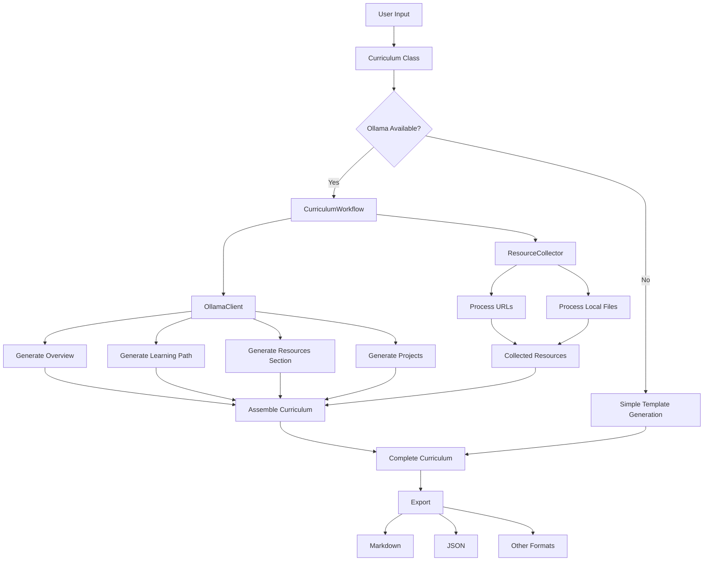

# Osyllabi Curriculum Generation Workflow

This document outlines how Osyllabi generates new curriculums using AI integration with Ollama, resource collection, and content assembly.

## Workflow Diagram

## Explanation

The Osyllabi curriculum generation workflow implements a modular approach to creating educational content with AI assistance. Here's how it works:

1. **User Input**: The process begins with user inputs including the main topic, skill level, optional resource links, and source files or directories.

2. **Curriculum Class**: The main `Curriculum` class receives these inputs and determines whether to use advanced AI generation or a simple template approach.

3. **AI Availability Check**: The system checks if the Ollama server is accessible. If it is, the workflow continues with AI-powered generation; otherwise, it falls back to simple template-based generation.

4. **Resource Collection**: The `ResourceCollector` gathers content from two types of sources:
   - URLs provided by the user, from which it extracts and processes content
   - Local files and directories, which are scanned for relevant educational material

5. **AI Content Generation**: When Ollama is available, four main curriculum components are generated through the `OllamaClient`:
   - **Overview**: An introduction explaining the topic, its importance, target audience, and learning outcomes
   - **Learning Path**: A structured progression of modules with clear objectives and time estimates
   - **Resources Section**: Curated learning materials incorporating user-provided links
   - **Projects**: Practical exercises that reinforce concepts with increasing complexity

6. **Content Assembly**: All generated sections are assembled into a cohesive curriculum document with proper formatting and structure.

7. **Export**: The final curriculum is exported in the user's chosen format (Markdown, JSON, etc.), with metadata included.

This workflow provides flexibility by:
- Working offline with simple templates when AI is unavailable
- Integrating local content with web resources
- Supporting various export formats for different use cases
- Using modular components that can be independently updated or replaced

The implementation leverages prompt templates, resource collection algorithms, and AI integration to create personalized learning paths tailored to specific topics and skill levels.
