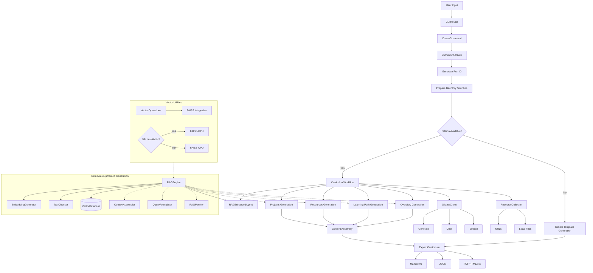

# Osyllabi Curriculum Generation Workflow

This document outlines how Osyllabi generates new curriculums using AI integration with Ollama, retrieval-augmented generation (RAG), and resource collection.

## Workflow Diagram



## Core Components

### Command Line Interface

Osyllabi's CLI provides a user-friendly interface for curriculum generation:

```bash
osyllabi create \
    --topic "Machine Learning" \
    --title "Introduction to Machine Learning" \
    --level "Beginner" \
    --links "https://scikit-learn.org/" \
    --source "./resources" \
    --format "md"
```

The workflow begins with `CreateCommand`, which processes arguments and calls `Curriculum.create()`, initiating the generation process.

### Curriculum Generation

The `Curriculum` class serves as the primary entry point, which:

1. Generates a unique run ID based on timestamp
2. Creates directory structure for outputs and artifacts
3. Checks for Ollama availability
4. Delegates content generation to `CurriculumWorkflow`
5. Handles exporting to various formats (Markdown, JSON, etc.)

### RAG System Integration

Osyllabi leverages a Retrieval-Augmented Generation (RAG) system that enhances content generation using relevant context:

#### RAG Components

1. **RAGEngine**: Coordinates the entire retrieval process

   ```python
   rag_engine = RAGEngine(run_id="12345", embedding_model="llama3")
   rag_engine.add_document(text="Python is a programming language...", metadata={"source": "documentation"})
   relevant_context = rag_engine.retrieve("How to learn Python?", top_k=5)
   ```

2. **EmbeddingGenerator**: Creates vector embeddings using Ollama's API

   ```python
   embedder = EmbeddingGenerator(model_name="llama3")
   embedding = embedder.embed_text("Python programming basics")
   ```

3. **TextChunker**: Splits documents into manageable pieces for embedding

   ```python
   chunker = TextChunker(chunk_size=512, overlap=50)
   chunks = chunker.chunk_text(long_document)
   ```

4. **VectorDatabase**: Stores and retrieves embeddings using SQLite

   ```python
   vector_db = VectorDatabase("./vectors.db")
   vector_db.add_document(chunks, embeddings, metadata={"source": "textbook"})
   results = vector_db.search(query_vector, top_k=5)
   ```

5. **ContextAssembler**: Formats retrieved chunks for prompt enhancement

   ```python
   assembler = ContextAssembler(format_style="markdown")
   context = assembler.assemble_context(retrieved_chunks=results)
   ```

6. **QueryFormulator**: Generates effective queries for retrieval

   ```python
   formulator = QueryFormulator()
   query = formulator.formulate_query(topic="Python", query_type="learning_path")
   ```

### Vector Operations and GPU Acceleration

Vector operations leverage scientific libraries for efficiency:

1. **Vector Utilities**: Provides functions for vector mathematics using scikit-learn

   ```python
   from osyllabi.utils.vector import cosine_similarity, normalize_vector
   similarity = cosine_similarity(vec1, vec2)
   ```

2. **FAISS Integration**: Optional acceleration for vector search

   ```python
   from osyllabi.utils.vector import create_faiss_index, faiss_search
   index = create_faiss_index(vectors, use_gpu=True)
   distances, indices = faiss_search(index, query_vector, k=5)
   ```

3. **GPU Detection**: Automatic GPU detection and utilization

   ```python
   from osyllabi.utils.utils import detect_gpu, upgrade_faiss_to_gpu
   has_gpu, gpu_info = detect_gpu()
   if has_gpu:
       success, message = upgrade_faiss_to_gpu()
   ```

### Resource Collection

The `ResourceCollector` gathers information from various sources:

1. **URL Processing**: Extracts content from web resources
2. **Local Files**: Analyzes source files and directories
3. **Content Analysis**: Extracts meaningful information for RAG ingestion

### Content Generation

The `CurriculumWorkflow` class coordinates the generation of curriculum components:

1. **Overview Generation**: Creates introduction and learning outcomes
2. **Learning Path Generation**: Designs structured progression of modules
3. **Resources Generation**: Curates learning materials
4. **Projects Generation**: Develops practical exercises

Each generation step is enhanced with RAG context using the `RAGEnhancedAgent`:

```python
agent = RAGEnhancedAgent("learning_path_agent", rag_engine=rag_engine)
context = agent.retrieve_context(topic="Python", query_type="learning_path")
enhanced_prompt = agent.create_enhanced_prompt(base_prompt, topic="Python", query_type="learning_path")
```

## Performance Optimization

Osyllabi includes several optimization strategies:

1. **Efficient Vector Search**: Using FAISS for approximate nearest neighbor search
2. **GPU Acceleration**: Automatic detection and utilization of GPU resources
3. **Asynchronous Processing**: Resources are processed concurrently where possible
4. **Caching**: Embeddings are stored to avoid redundant computation
5. **Performance Monitoring**: RAGMonitor tracks metrics for optimization

## Export Formats

The final curriculum can be exported in multiple formats:

1. **Markdown**: Default format with rich text formatting
2. **JSON**: Structured data format for programmatic use
3. **PDF/HTML**: Rich document formats for sharing and publishing (planned)

Each export includes metadata about the generation process, resources used, and configuration settings.
