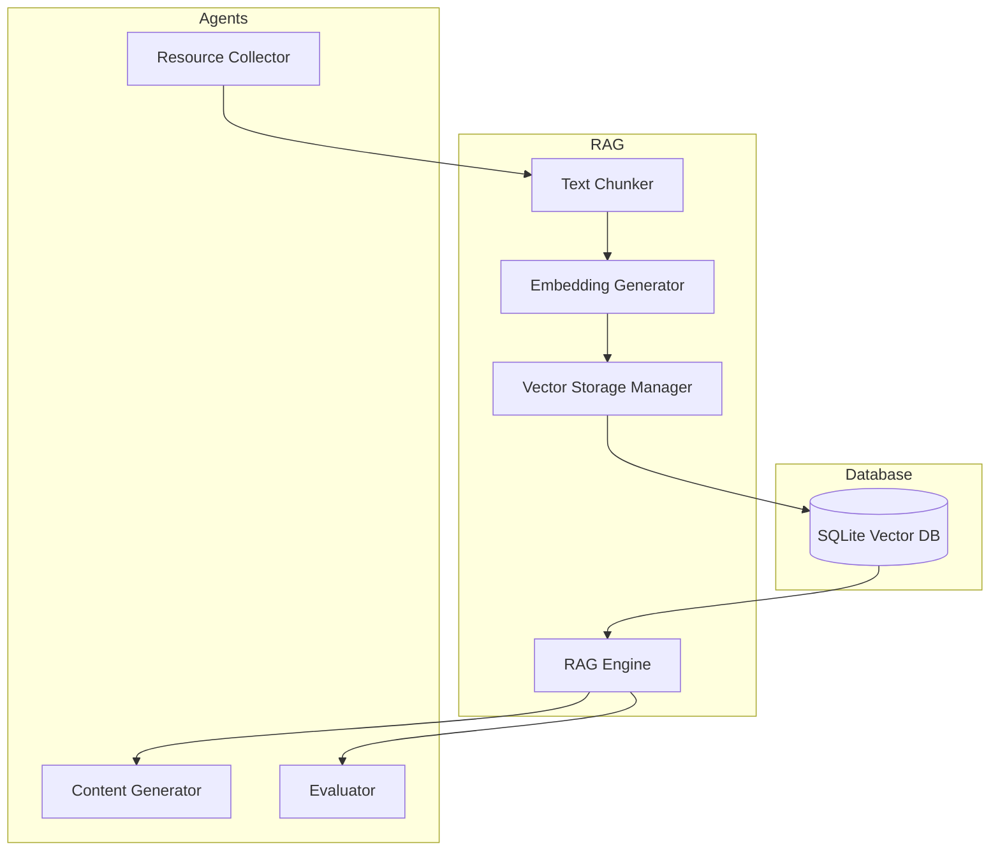

# Osyllabi RAG Implementation Plan

This document outlines the implementation plan for adding Retrieval-Augmented Generation (RAG) capability to Osyllabi.

## Architecture Overview



## Implementation Status

### Phase 1: Core RAG Infrastructure ✅

1. **Vector Database** ✅
   - Created SQLite database schema for vector storage
   - Implemented basic vector operations (add, search)
   - Added run-specific database management with isolation per run

2. **Text Processing** ✅
   - Implemented text chunking with configurable size and overlap
   - Created preprocessing pipeline (normalization, cleaning)
   - Added paragraph-based and character-based chunking strategies

3. **Embedding System** ✅
   - Added sentence-transformers integration
   - Implemented batch processing for document sets
   - Added fallback mechanism when models aren't available

4. **RAG Engine** ✅
   - Built main RAG engine interface
   - Implemented document adding and retrieval functionality
   - Created run-specific configuration storage

### Phase 2: Agent Integration 🔄

1. **Resource Collection** 🔄
   - Resource collector framework updated
   - Support for metadata extraction added
   - Integration with specialized agents in progress

2. **Content Generation** 🔄
   - Framework for RAG-augmented prompts established
   - Initial RAG-enhanced generation agents designed
   - Context filtering and assembly mechanisms developed

3. **Evaluation System** ⏳
   - Initial design for RAG-based fact checking completed
   - Accuracy metrics definition in progress
   - Relevance evaluation mechanism planned

### Phase 3: Management & Optimization ⏳

1. **Performance Optimization** ⏳
   - Basic cosine similarity search implemented
   - Batch processing framework designed
   - Approximate nearest neighbor search planned

2. **Storage Management** ⏳
   - Basic file-based persistence implemented
   - Database cleanup utilities planned
   - Efficient serialization in development

3. **Configuration System** ✅
   - Configurable RAG parameters added to global config
   - Run-specific configuration profiles implemented
   - Environment variable overrides supported

## Required Dependencies

| Package | Version | Purpose | Status |
|---------|---------|---------|--------|
| sentence-transformers | >=2.2.2 | Text embedding generation | ✅ Implemented |
| numpy | >=1.24.0 | Vector operations | ✅ Implemented |
| sqlite3 | Standard lib | Database functionality | ✅ Implemented |
| scikit-learn | Future | Advanced vector search | ⏳ Planned |
| faiss-cpu | Future | Optional faster vector search | ⏳ Planned |

## Project Structure

```bash
osyllabi/
├── rag/
│   ├── __init__.py          # Package exports            ✅ Implemented
│   ├── database.py          # Vector database management ✅ Implemented
│   ├── embedding.py         # Embedding generation       ✅ Implemented
│   ├── engine.py            # Main RAG engine            ✅ Implemented
│   └── chunking.py          # Text chunking              ✅ Implemented
├── utils/
│   └── vector/              # Vector utilities           ⏳ Planned
├── config.py                # RAG configuration settings ✅ Implemented
```

## Remaining Tasks

1. **Integration**
   - Connect RAG engine to agent framework
   - Update prompt templates to use retrieved context
   - Develop context filtering mechanism

2. **Advanced Features**
   - Implement approximate nearest neighbor search
   - Add context relevance scoring
   - Design cross-run knowledge sharing

3. **Testing & Validation**
   - Design evaluation metrics for RAG quality
   - Create benchmark tests for retrieval accuracy
   - Compare curriculum quality with and without RAG

## Success Criteria

The RAG implementation will be considered successful when:

1. Content generation quality improves by at least 20% based on evaluation metrics
2. Performance overhead is less than 2x compared to non-RAG generation
3. Database size remains manageable (under 100MB per curriculum generation)
4. Integration is modular and doesn't require significant changes to existing agents
