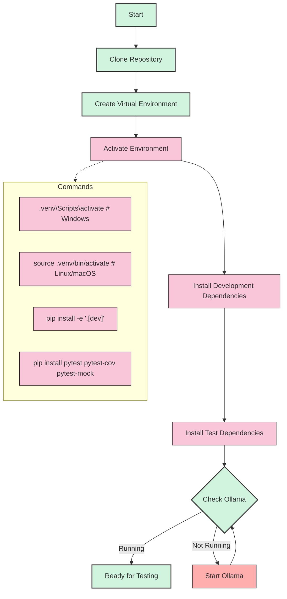
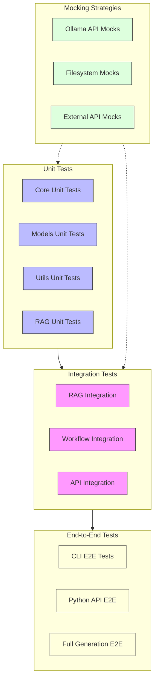
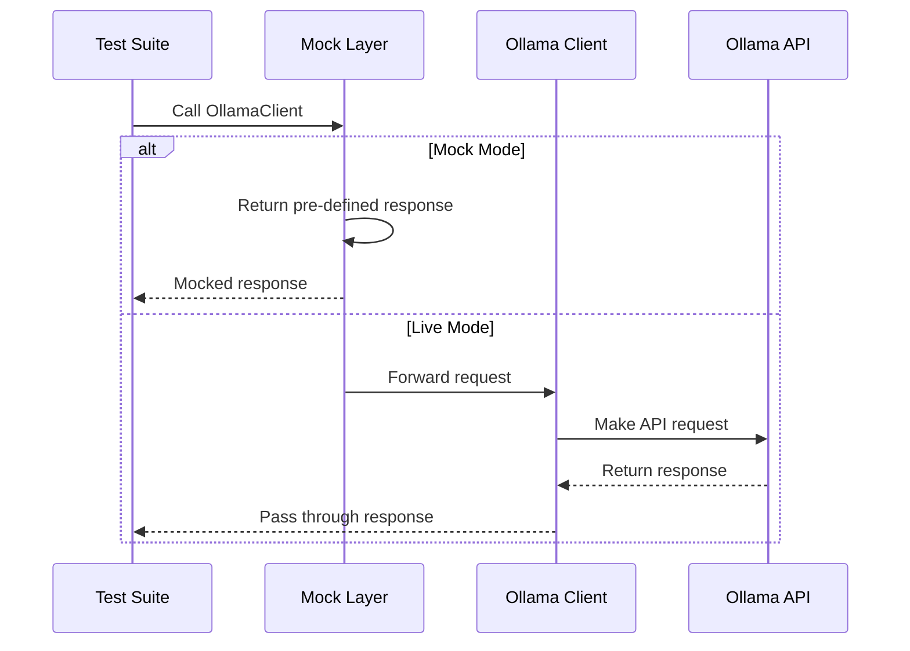
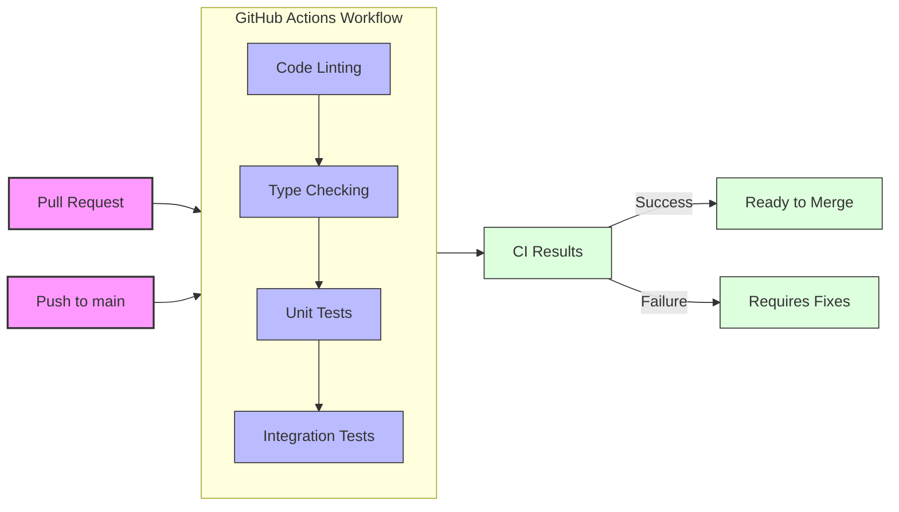
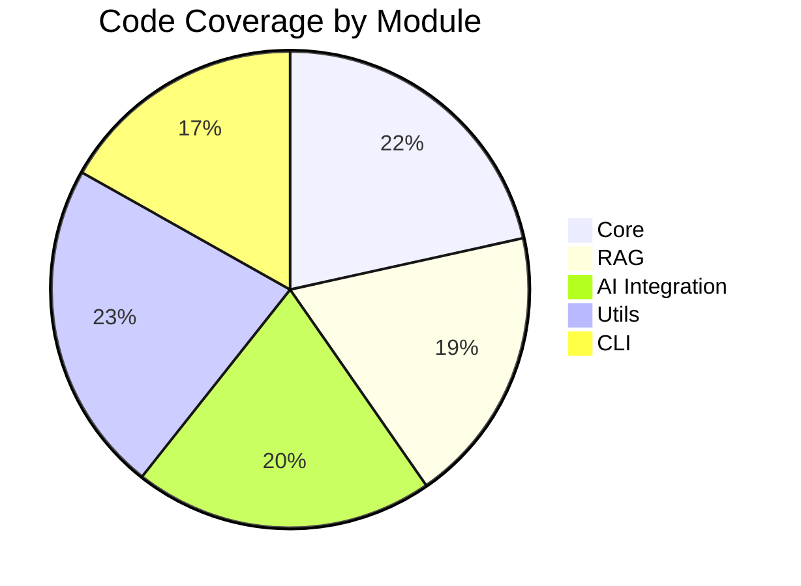
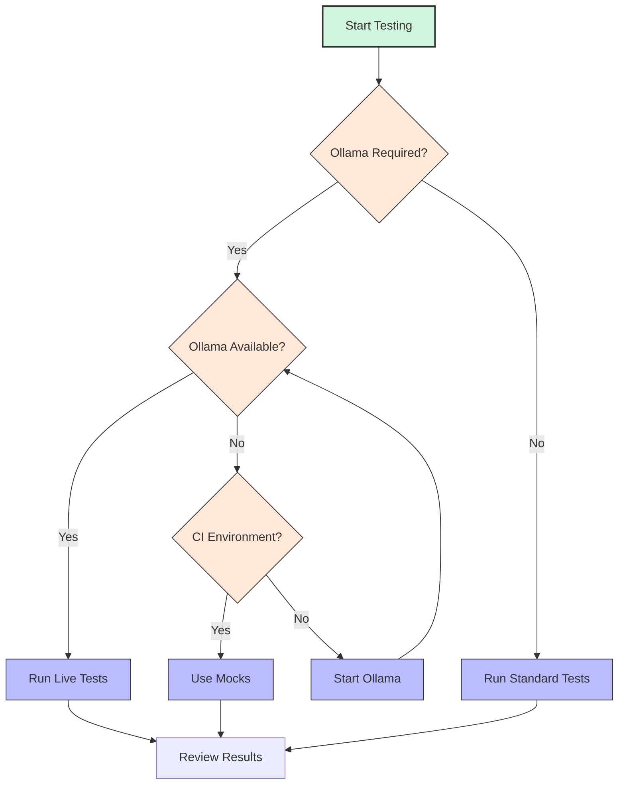

<!-- markdownlint-disable MD033 MD032 MD031 MD040 -->
# Osyllabi Testing Guide

This document provides comprehensive instructions for running and creating tests for the Osyllabi project.

## Table of Contents

- [Setting Up the Testing Environment](#setting-up-the-testing-environment)
- [Testing Architecture](#testing-architecture)
- [Running Tests](#running-tests)
  - [Unit Tests](#unit-tests)
  - [Integration Tests](#integration-tests)
  - [End-to-End Tests](#end-to-end-tests)
- [Testing the Ollama Integration](#testing-the-ollama-integration)
- [Writing New Tests](#writing-new-tests)
- [Continuous Integration](#continuous-integration)
- [Code Coverage](#code-coverage)
- [Troubleshooting](#troubleshooting)

## Setting Up the Testing Environment

Before running tests, ensure you have set up your development environment correctly:



1. Activate your virtual environment:

   ```bash
   # Windows
   .venv\Scripts\activate
   
   # Linux/macOS
   source .venv/bin/activate
   ```

2. Install development dependencies:

   ```bash
   pip install -e ".[dev]"
   ```

3. Install test dependencies:

   ```bash
   pip install pytest pytest-cov mock
   ```

4. Ensure Ollama is installed and running for tests that require AI functionality:

   ```bash
   # Check if Ollama is running
   curl http://localhost:11434
   ```

## Testing Architecture

Osyllabi employs a comprehensive testing strategy across multiple levels:



This multi-layered approach ensures that different aspects of the system are thoroughly tested, from individual components to complete workflows.

## Running Tests

### Unit Tests

Unit tests validate individual components in isolation. To run all unit tests:

```bash
# Run all unit tests
pytest osyllabi/tests/

# Run a specific test file
pytest osyllabi/tests/ollama_test.py

# Run tests with output displayed
pytest -v osyllabi/tests/

# Run tests with specific markers
pytest -m "not slow" osyllabi/tests/
```

### Integration Tests

Integration tests validate how components work together:

```bash
# Run integration tests
pytest osyllabi/tests/integration/

# Run specific integration test group
pytest osyllabi/tests/integration/test_workflow.py

# Run with JUnit XML report generation
pytest osyllabi/tests/integration/ --junitxml=reports/integration.xml
```

### End-to-End Tests

End-to-end tests validate the complete application workflow:

```bash
# Run E2E tests (these require Ollama to be running)
pytest osyllabi/tests/e2e/

# Run with extended timeout for API tests
pytest --timeout=300 osyllabi/tests/e2e/

# Run with fail-fast option
pytest -xvs osyllabi/tests/e2e/
```

## Testing the Ollama Integration

The Ollama integration is a critical component that requires special testing considerations:



1. **Mock Tests**: Use mock tests when you want to test logic without actually calling Ollama:

   ```bash
   # Run tests that mock Ollama API calls
   pytest osyllabi/tests/ollama_test.py
   ```

2. **Live Tests**: For tests that interact with a running Ollama instance:

   ```bash
   # Set environment variable to use real Ollama instance
   export OSYLLABI_TEST_USE_REAL_OLLAMA=1
   
   # Run the live tests
   pytest osyllabi/tests/live/test_ollama_live.py
   ```

3. **Required Models**: Some tests require specific models to be available in Ollama:

   ```bash
   # Install required models for testing
   ollama pull llama3.1:latest
   ollama pull llama3:latest
   ```

## Writing New Tests

Follow these guidelines when creating new tests:

1. **Test File Organization**:

```bash
osyllabi/
├── tests/
│   ├── __init__.py
│   ├── conftest.py            # Shared fixtures
│   ├── test_curriculum.py     # Unit tests
│   ├── test_ollama.py         # Unit tests
│   ├── integration/
│   │   ├── __init__.py
│   │   └── test_workflow.py   # Integration tests
│   └── e2e/
│       ├── __init__.py 
│       └── test_cli.py        # End-to-end tests
```

2. **Test Class Structure**:

   ```python
   import unittest
   from unittest.mock import patch, MagicMock

   class TestYourFeature(unittest.TestCase):
       def setUp(self):
           # Setup code that runs before each test
           pass
           
       def tearDown(self):
           # Cleanup code that runs after each test
           pass
           
       def test_specific_functionality(self):
           # Your test code here
           self.assertEqual(expected_result, actual_result)
   ```

2. **Mocking Ollama**:

   ```python
   @patch('osyllabi.ai.client.requests.post')
   def test_generate_with_mocked_ollama(self, mock_post):
       # Setup the mock response
       mock_response = MagicMock()
       mock_response.json.return_value = {"message": {"content": "Mocked response"}}
       mock_response.raise_for_status.return_value = None
       mock_post.return_value = mock_response
       
       # Test code that uses Ollama
       from osyllabi.ai.client import OllamaClient
       client = OllamaClient()
       result = client.generate("Test prompt")
       
       # Assertions
       self.assertEqual("Mocked response", result)
   ```

3. **Pytest Fixtures**:

   ```python
   # In conftest.py
   import pytest
   
   @pytest.fixture
   def sample_curriculum_data():
       return {
           "topic": "Python",
           "title": "Learning Python",
           "skill_level": "Beginner"
       }
   
   # In your test file
   def test_curriculum_creation(sample_curriculum_data):
       from osyllabi import Curriculum
       
       curriculum = Curriculum(**sample_curriculum_data)
       assert curriculum.topic == "Python"
       assert curriculum.title == "Learning Python"
   ```

## Continuous Integration

The project uses GitHub Actions for continuous integration:



1. Tests automatically run on:
   - Pull requests to the main branch
   - Direct pushes to the main branch

2. CI workflow includes:
   - Linting with flake8
   - Type checking with mypy
   - Unit tests with pytest
   - Integration tests (with mocked external dependencies)

3. Viewing CI results:
   - Access test results from the GitHub Actions tab in the repository
   - Review test coverage reports in the CI artifacts

## Code Coverage

Track and improve test coverage:

```bash
# Generate coverage report
pytest --cov=osyllabi --cov-report=html osyllabi/tests/

# Open the HTML report
# On Windows
start htmlcov/index.html

# On macOS
open htmlcov/index.html

# On Linux
xdg-open htmlcov/index.html
```

The coverage report will highlight areas of code that lack test coverage:



## Troubleshooting

Common testing issues and solutions:

### Ollama Connection Errors

If tests fail with Ollama connection errors:

1. Verify Ollama is running:

   ```bash
   curl http://localhost:11434
   ```

2. Use environment variables to configure Ollama URL:

   ```bash
   export OSYLLABUS_OLLAMA_URL="http://localhost:11434"
   ```

3. For CI environments, use the mock tests instead of live Ollama tests.

### Test Decision Flow



### Slow Tests

If tests are running slowly:

1. Run only specific test categories:

   ```bash
   # Run only fast tests
   pytest -m "not slow" osyllabi/tests/
   ```

2. Increase parallelism:

   ```bash
   # Run tests in parallel
   pytest -xvs -n auto osyllabi/tests/
   ```

### Test Isolation Issues

If tests are affecting each other:

1. Ensure proper cleanup in tearDown methods
2. Use temporary directories for file operations:

   ```python
   import tempfile
   import shutil
   
   # In setUp
   self.test_dir = tempfile.mkdtemp()
   
   # In tearDown
   shutil.rmtree(self.test_dir)
   ```

---

For more information or assistance with testing, please open an issue on our [GitHub repository](https://github.com/p3nGu1nZz/osyllabi/issues).
