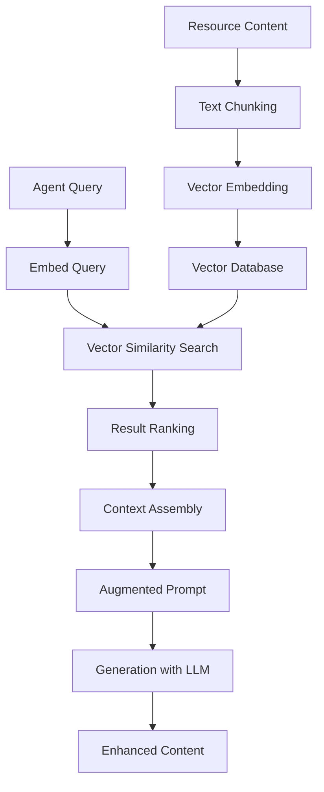

# Retrieval-Augmented Generation (RAG) System

This document explains how Osyllabi uses RAG to enhance curriculum generation by leveraging a lightweight vector database for each generation run.

## What is RAG?

Retrieval-Augmented Generation (RAG) combines the strengths of retrieval-based and generative AI systems:

1. **Retrieval**: Finding relevant information from a knowledge base
2. **Augmentation**: Enriching prompts with this retrieved information
3. **Generation**: Creating high-quality content using the augmented context

In Osyllabi, RAG helps ensure our curriculum content is:

- **Accurate** - Based on factual information from reliable sources
- **Relevant** - Tailored to the specific topic and skill level
- **Up-to-date** - Including the latest resources and approaches
- **Comprehensive** - Covering important aspects that might otherwise be missed

## System Architecture



### Key Components

#### 1. Vector Database

Osyllabi uses a SQLite database for storing and retrieving vector embeddings:

```python
class VectorDatabase:
    """SQLite-based vector database for curriculum RAG."""
    
    def __init__(self, db_path):
        self.db_path = Path(db_path)
        self.db_path.parent.mkdir(parents=True, exist_ok=True)
        
        # Initialize the database
        self.conn = sqlite3.connect(str(self.db_path))
        self.conn.execute("PRAGMA foreign_keys = ON")
        
        # Initialize schema
        self._initialize_schema()
    
    def _initialize_schema(self):
        """Set up database tables if they don't exist."""
        cursor = self.conn.cursor()
        
        # Create chunks table
        cursor.execute("""
            CREATE TABLE IF NOT EXISTS chunks (
                id INTEGER PRIMARY KEY,
                text TEXT NOT NULL,
                source TEXT,
                metadata TEXT
            )
        """)
        
        # Create vectors table
        cursor.execute("""
            CREATE TABLE IF NOT EXISTS vectors (
                id INTEGER PRIMARY KEY,
                chunk_id INTEGER NOT NULL,
                vector BLOB NOT NULL,
                FOREIGN KEY (chunk_id) REFERENCES chunks(id)
            )
        """)
        
        # Create indices for performance
        cursor.execute("CREATE INDEX IF NOT EXISTS idx_chunks_source ON chunks(source)")
        
        self.conn.commit()
    
    def search(self, query_vector, top_k=5, threshold=0.0):
        """Find most similar vectors using cosine similarity."""
        # Convert query vector to numpy array
        query_np = np.array(query_vector, dtype=np.float32)
        
        # Fetch vectors and calculate similarity
        cursor = self.conn.cursor()
        cursor.execute("""
            SELECT v.id, v.chunk_id, v.vector, c.text, c.source, c.metadata
            FROM vectors v
            JOIN chunks c ON v.chunk_id = c.id
        """)
        
        results = []
        for row in cursor.fetchall():
            vec_id, chunk_id, vector_bytes, text, source, meta_str = row
            
            # Convert binary vector to numpy array
            vector = np.frombuffer(vector_bytes, dtype=np.float32)
            
            # Calculate cosine similarity
            similarity = self._cosine_similarity(query_np, vector)
            
            # Only include results above threshold
            if similarity >= threshold:
                # Parse metadata
                metadata = json.loads(meta_str) if meta_str else {}
                
                results.append({
                    "id": chunk_id,
                    "text": text,
                    "source": source,
                    "metadata": metadata,
                    "similarity": float(similarity)
                })
        
        # Sort by similarity (descending) and take top_k
        results.sort(key=lambda x: x["similarity"], reverse=True)
        return results[:top_k]
```

#### 2. Embedding Generator

Osyllabi uses SentenceTransformers for generating embeddings with a fallback mechanism:

```python
class EmbeddingGenerator:
    """Generate embeddings for text using SentenceTransformers."""
    
    def __init__(self, model_name="all-MiniLM-L6-v2"):
        self.model_name = model_name
        self.model = None
        self._initialize_model()
        
    def _initialize_model(self):
        # Check if sentence-transformers is available
        if not importlib.util.find_spec("sentence_transformers"):
            log.warning("sentence-transformers package not found. "
                       "Installing required package...")
            os.system("pip install sentence-transformers")
        
        try:
            from sentence_transformers import SentenceTransformer
            self.model = SentenceTransformer(self.model_name)
            log.info(f"Initialized embedding model: {self.model_name}")
        except Exception as e:
            log.error(f"Failed to load embedding model: {e}")
            log.warning("Using fallback embedding method")
            self.model = None
            
    def embed_text(self, text):
        """Generate embedding for a single text."""
        if self.model:
            embedding = self.model.encode([text])[0]
            return embedding.tolist()
        else:
            return self._fallback_embed(text)
```

#### 3. Text Chunker

The chunker intelligently splits documents using both paragraph and character boundaries:

```python
class TextChunker:
    """Split text into chunks for embedding."""
    
    def __init__(self, chunk_size=512, overlap=50):
        self.chunk_size = chunk_size
        self.overlap = min(overlap, chunk_size // 2)
        
    def chunk_text(self, text):
        """Split text into overlapping chunks."""
        if not text or len(text) < self.chunk_size // 2:
            return [text] if text else []
            
        # Clean the text
        cleaned_text = self._clean_text(text)
        
        # Try to chunk by paragraphs first
        chunks = self._chunk_by_paragraphs(cleaned_text)
        
        # If paragraph chunking yields too few or too large chunks, 
        # fall back to character-based chunking
        if not chunks or any(len(chunk) > self.chunk_size * 2 for chunk in chunks):
            chunks = self._chunk_by_characters(cleaned_text)
            
        return chunks
```

#### 4. RAG Engine

The RAG Engine coordinates the entire process with run-specific isolation:

```python
class RAGEngine:
    """Retrieval-Augmented Generation engine for curriculum content."""
    
    def __init__(
        self,
        run_id=None,
        base_dir=None,
        embedding_model="all-MiniLM-L6-v2",
        chunk_size=512,
        chunk_overlap=50
    ):
        # Generate run ID if not provided
        self.run_id = run_id or str(int(time.time()))
        self.base_dir = Path(base_dir) if base_dir else Path.cwd() / "output" / self.run_id
        
        # Create vector database directory
        self.vector_dir = self.base_dir / "vectors"
        self.vector_dir.mkdir(parents=True, exist_ok=True)
        
        # Create components
        db_path = self.vector_dir / "vector.db"
        self.vector_db = VectorDatabase(db_path)
        self.embedder = EmbeddingGenerator(model_name=embedding_model)
        self.chunker = TextChunker(chunk_size=chunk_size, overlap=chunk_overlap)
        
    def add_document(self, text, metadata=None):
        """Process and add a document to the vector store."""
        # Skip empty content
        if not text or not text.strip():
            return 0
            
        # Chunk the text
        chunks = self.chunker.chunk_text(text)
        if not chunks:
            return 0
            
        # Generate embeddings
        embeddings = self.embedder.embed_texts(chunks)
        
        # Store in database
        chunk_ids = self.vector_db.add_document(chunks, embeddings, metadata or {})
        return len(chunks)
        
    def retrieve(self, query, top_k=5, threshold=0.0):
        """Retrieve relevant context for a query."""
        # Generate query embedding
        query_embedding = self.embedder.embed_text(query)
        
        # Search for similar chunks
        results = self.vector_db.search(query_embedding, top_k=top_k, threshold=threshold)
        return results
```

### RAG-Enhanced Agent Example

Here's how an agent uses RAG to create better curriculum content:

```python
class LearningPathAgent(Agent):
    """Agent for generating learning paths with RAG support."""
    
    async def execute(self, context):ate a learning path for Python programming for beginners.
        # Generate basic query```
        query = f"learning path for {context.topic} at {context.skill_level} level"
        h RAG:
        # Get relevant context from RAG engine
        relevant_docs = self.retrieve_relevant_context(query, top_k=5)```plaintext
        
        # Format retrieved context for prompt
        context_text = "\n\n".join([d relevance:
            f"Source: {doc['source']}\n{doc['text']}" 
            for doc in relevant_docs
        ])ntext 2: Python tutorial structure from python.org]
        [Context 3: Learning path analysis from previous successful curriculum]
        # Create enhanced prompt
        prompt_template = PromptTemplate.from_preset("learning_path_with_context")
        prompt = prompt_template.format(g Resource Recommendations
            topic=context.topic,
            skill_level=context.skill_level,
            retrieved_context=context_text
        )```plaintext
         books and tutorials for machine learning beginners.
        # Generate content using enhanced prompt
        learning_path = await self.client.generate(prompt)
        With RAG:
        # Store results and return
        self.results["learning_path"] = learning_path```plaintext
        return learning_path
        
    def retrieve_relevant_context(self, query, top_k=5):
        """Get relevant context from RAG engine."""
        if hasattr(self, "rag_engine") and self.rag_engine:[Context 1: Top-rated ML book reviews with difficulty levels]
            return self.rag_engine.retrieve(query, top_k=top_k)eware information from top universities]
        return [][Context 3: Github repository statistics for ML tutorial projects]
```

## Performance Considerations

### Limitations

1. **Model Dependency**: Embedding quality depends on the chosen model.
2. **Cold Start**: The first generation has minimal context until resources are processed.
3. **Cross-Curriculum Knowledge**: Each curriculum run has its own isolated knowledge base.
4. **Language Support**: Current embedding models work best with English content.

### Speed Optimization

Several techniques improve RAG performance:

1. **Paragraph-based Chunking**: The system tries to preserve semantic units by chunking at paragraph boundaries.
2. **Asynchronous Processing**: Resources are processed as they're collected.
3. **Fallback Mechanisms**: The system can operate even when optimal components aren't available.
4. **Isolation by Run**: Each curriculum generation has its own vector database to prevent cross-contamination.

### Memory Usage

- **Memory Usage**: 50-200 MB during generation, depending on the embedding model.
- **Database Size**: Typically 10-50 MB per curriculum run.
- **Disk Space**: Each run creates its own database, stored in the run directory.

### Enhancements

1. **Hybrid Search**: Combine vector search with keyword and metadata filtering.
2. **Active Learning**: Improve embeddings based on user feedback.
3. **Multi-Modal Embeddings**: Support for images and code in addition to text.
4. **Reranking**: Use a second model to rerank initial search results for higher relevance.
