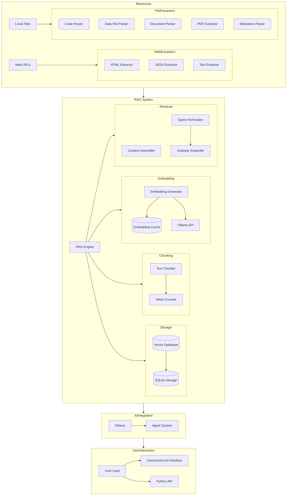

# Retrieval-Augmented Generation (RAG) System

Osyllabi implements a sophisticated Retrieval-Augmented Generation (RAG) system to enhance curriculum generation by incorporating relevant information from various sources.

## System Architecture



## Core Components

### RAG Engine

The `RAGEngine` class serves as the central coordinator for the entire RAG system, providing a high-level interface for:

- Adding documents to the knowledge base
- Retrieving relevant context for queries
- Managing persistent storage of embeddings and chunks

```python
# Initialize RAG engine
rag_engine = RAGEngine(
    run_id="curriculum_12345",
    embedding_model="llama3"
)

# Add documents to knowledge base
rag_engine.add_document(
    text="Python is a programming language...",
    metadata={"source": "documentation"}
)

# Retrieve relevant context
results = rag_engine.retrieve(
    query="How to start learning Python?",
    top_k=5
)
```

### Content Extractors

The system includes specialized extractors for different content types:

#### Web Resource Extractors

- **HTMLExtractor**: Parses HTML content using BeautifulSoup for improved extraction
- **JSONExtractor**: Processes JSON responses from APIs and web services
- **TextExtractor**: Handles plain text resources

#### File Resource Extractors

- **CodeFileExtractor**: Analyzes source code structure across multiple programming languages
- **DataFileExtractor**: Processes structured data files (CSV, JSON, YAML)
- **FileExtractor**: Basic file handling with markdown support
- **PDFExtractor**: Extracts text content from PDF files using PyMuPDF
- **DocxExtractor**: Processes Microsoft Word documents using python-docx

### Document Processing

The document processing pipeline includes:

1. **Resource Collection**: Gathering content from URLs and local files
2. **Content Extraction**: Parsing different file formats with specialized extractors
3. **Text Chunking**: Breaking content into manageable pieces
4. **Embedding Generation**: Converting text chunks to vector embeddings
5. **Vector Storage**: Saving embeddings in the vector database
6. **Retrieval**: Finding relevant content for prompts

## Vector Operations

The system uses optimized vector operations for similarity search:

- **cosine_similarity**: Fast cosine similarity calculation
- **normalize_vector**: L2 normalization for vectors
- **batch_cosine_similarity**: Efficient batch similarity operations
- **FAISS integration**: Approximate nearest neighbor search with optional GPU acceleration

## Enhanced Context Assembly

The `ContextAssembler` creates high-quality context for prompts:

- **Format customization**: Different context formats (simple, detailed, markdown)
- **Relevance scoring**: Ordering by similarity score
- **Deduplication**: Removing redundant content
- **Keyword highlighting**: Emphasizing important terms
- **Source attribution**: Including source information for retrieved content

## Query Formulation

The `QueryFormulator` enhances retrieval with:

- **Domain-specific queries**: Tailoring queries to the subject area
- **Query expansion**: Including related terms and subtopics
- **Template-based generation**: Using templates for different query types
- **Hierarchical queries**: Creating queries at different levels of specificity

## Monitoring and Optimization

The system includes performance monitoring through `RAGMonitor`:

- **Retrieval metrics**: Tracking hit rates and latency
- **Embedding performance**: Monitoring embedding generation time
- **Query history**: Recording recent queries and results
- **Statistics tracking**: Collecting system-wide performance data
````
